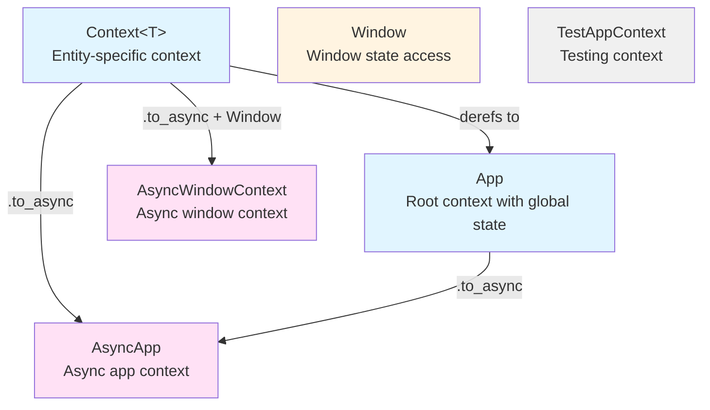

# GPUI Architecture

This document provides visual diagrams to help understand the GPUI framework's architecture and core concepts.

## Context Types Hierarchy



## Entity Lifecycle and Interactions

```mermaid
graph TB
    subgraph "Entity Operations"
        Entity[Entity&lt;T&gt;]
        WeakEntity[WeakEntity&lt;T&gt;]
        State[T: State Data<br/>Owned by App]
    end

    subgraph "Read Operations"
        Read[entity.read&#40;cx&#41;<br/>Returns &T]
        ReadWith[entity.read_with&#40;cx, fn&#41;<br/>Returns closure result]
    end

    subgraph "Update Operations"
        Update[entity.update&#40;cx, fn&#41;<br/>Provides &mut T + Context&lt;T&gt;]
        UpdateIn[entity.update_in&#40;cx, fn&#41;<br/>Provides &mut T + Window + Context&lt;T&gt;]
    end

    subgraph "Other Operations"
        EntityId[entity.entity_id&#40;&#41;<br/>Returns EntityId]
        Downgrade[entity.downgrade&#40;&#41;<br/>Returns WeakEntity&lt;T&gt;]
        Notify[cx.notify&#40;&#41;<br/>Trigger rerender/observers]
        Emit[cx.emit&#40;event&#41;<br/>Emit entity events]
    end

    Entity -.->|references| State
    Entity -->|can become| WeakEntity
    WeakEntity -.->|weak ref| State

    Entity --> Read
    Entity --> ReadWith
    Entity --> Update
    Entity --> UpdateIn
    Entity --> EntityId
    Entity --> Downgrade

    Update --> Notify
    Update --> Emit
    UpdateIn --> Notify
    UpdateIn --> Emit

    style Entity fill:#b3e5fc
    style WeakEntity fill:#ffccbc
    style State fill:#c8e6c9
```



## Concurrency Model

```mermaid
graph TB
    subgraph "Foreground Thread"
        FG[All Entity/UI Operations<br/>Single foreground thread]
        Spawn[cx.spawn&#40;async move &#124;cx&#124; ...&#41;<br/>Runs on foreground]
        AsyncContext[AsyncApp or<br/>AsyncWindowContext]
    end

    subgraph "Background Threads"
        BgSpawn[cx.background_spawn&#40;async move &#123; ... &#125;&#41;<br/>Runs on thread pool]
        BgWork[Heavy computation<br/>I/O operations<br/>Non-UI work]
    end

    subgraph "Task Management"
        Task[Task&lt;R&gt;<br/>Future that can be awaited]
        TaskReady[Task::ready&#40;value&#41;<br/>Immediate value]
        Detach[task.detach&#40;&#41;<br/>Run indefinitely]
        DetachLog[task.detach_and_log_err&#40;cx&#41;<br/>Run with error logging]
        Store[Store in struct field<br/>Cancel when dropped]
    end

    FG --> Spawn
    Spawn --> AsyncContext
    AsyncContext --> Task

    FG --> BgSpawn
    BgSpawn --> BgWork
    BgWork --> Task

    Task --> Detach
    Task --> DetachLog
    Task --> Store
    Task -.->|await| FG

    style FG fill:#e1f5ff
    style Spawn fill:#c8e6c9
    style BgSpawn fill:#ffccbc
    style Task fill:#fff9c4
```



## Rendering Pipeline

```mermaid
graph LR
    subgraph "Entity State"
        StateChange[State Mutated<br/>via entity.update]
        Notify[cx.notify&#40;&#41;<br/>Mark for rerender]
    end

    subgraph "Render Trait"
        Render[impl Render for T<br/>fn render&#40;&mut self, window, cx&#41;]
        RenderOnce[impl RenderOnce for T<br/>fn render&#40;self, window, cx&#41;]
    end

    subgraph "Element Tree"
        Elements[Element Tree<br/>div&#40;&#41;.child&#40;...&#41;]
        Styles[Tailwind-style methods<br/>.border_1&#40;&#41;.p_4&#40;&#41;]
        Conditional[.when&#40;cond, fn&#41;<br/>.when_some&#40;opt, fn&#41;]
    end

    subgraph "Layout & Display"
        Flexbox[Flexbox Layout]
        Paint[Paint to Screen]
    end

    StateChange --> Notify
    Notify --> Render
    Notify --> RenderOnce

    Render --> Elements
    RenderOnce --> Elements
    Elements --> Styles
    Elements --> Conditional

    Styles --> Flexbox
    Conditional --> Flexbox
    Flexbox --> Paint

    style Notify fill:#ffccbc
    style Render fill:#c8e6c9
    style Elements fill:#b3e5fc
    style Paint fill:#f0f0f0
```



## Event Flow

```mermaid
graph TB
    subgraph "Input Events"
        UserInput[User Input<br/>Mouse, Keyboard, etc]
        OnClick[element.on_click&#40;fn&#41;]
        OnKey[element.on_key_down&#40;fn&#41;]
        Listener[element.on_click&#40;cx.listener&#40;fn&#41;&#41;<br/>Auto-provides &mut T]
    end

    subgraph "Actions"
        ActionDef[Action Definition<br/>actions!&#40;ns, &#91;Action&#93;&#41;<br/>or #&#91;derive&#40;Action&#41;&#93;]
        ActionDispatch[window.dispatch_action&#40;action, cx&#41;<br/>or focus_handle.dispatch_action&#40;...&#41;]
        ActionHandler[element.on_action&#40;fn&#41;]
    end

    subgraph "Entity Events"
        EventEmit[cx.emit&#40;event&#41;<br/>in entity.update]
        EventDecl[impl EventEmitter&lt;E&gt; for T]
        Subscribe[cx.subscribe&#40;entity, fn&#41;<br/>Handle entity events]
        Subscription[Subscription<br/>Auto-cleanup on drop]
    end

    subgraph "Observation"
        ObserveCall[cx.notify&#40;&#41;<br/>in entity.update]
        Observer[cx.observe&#40;entity, fn&#41;<br/>Called on notify]
    end

    UserInput --> OnClick
    UserInput --> OnKey
    OnClick --> Listener
    OnKey --> Listener

    ActionDef --> ActionDispatch
    ActionDispatch --> ActionHandler
    ActionHandler --> Listener

    EventEmit --> EventDecl
    Subscribe --> EventDecl
    Subscribe --> Subscription

    ObserveCall --> Observer

    style UserInput fill:#e1f5ff
    style ActionDispatch fill:#c8e6c9
    style EventEmit fill:#ffccbc
    style ObserveCall fill:#fff9c4
```



## Complete Data Flow Example

```mermaid
sequenceDiagram
    participant User
    participant Element
    participant Handler
    participant Entity as Entity&lt;T&gt;
    participant State as T (State)
    participant Observers
    participant Render

    User->>Element: Click/Input
    Element->>Handler: on_click(cx.listener(...))
    Handler->>Entity: entity.update(cx, |state, cx| ...)
    Entity->>State: Mutate state
    Handler->>Entity: cx.notify()
    Entity->>Observers: Trigger observers
    Entity->>Render: Schedule rerender
    Render->>State: render(&mut self, window, cx)
    Render->>Element: Build element tree
    Element->>User: Display updated UI
```

## Key Principles

### Thread Safety
- All entity and UI operations occur on a single foreground thread
- Use `cx.background_spawn` for heavy work, then update entities on foreground
- Async contexts (`AsyncApp`, `AsyncWindowContext`) can be held across await points

### Memory Management
- `Entity<T>` is a strong handle
- `WeakEntity<T>` prevents memory leaks in cyclic references
- `Subscription` auto-cleanup prevents orphaned event handlers
- Dropped `Task<R>` cancels its work

### Rendering Optimization
- Call `cx.notify()` only when state changes affect rendering
- Use `RenderOnce` for ephemeral components
- Conditional rendering with `.when()` and `.when_some()`

### Error Handling
- Avoid `unwrap()` - use `?` to propagate errors
- Never discard errors with `let _ =` on fallible operations
- Use `.log_err()` when errors must be ignored but logged
- Async entity operations return `anyhow::Result`
